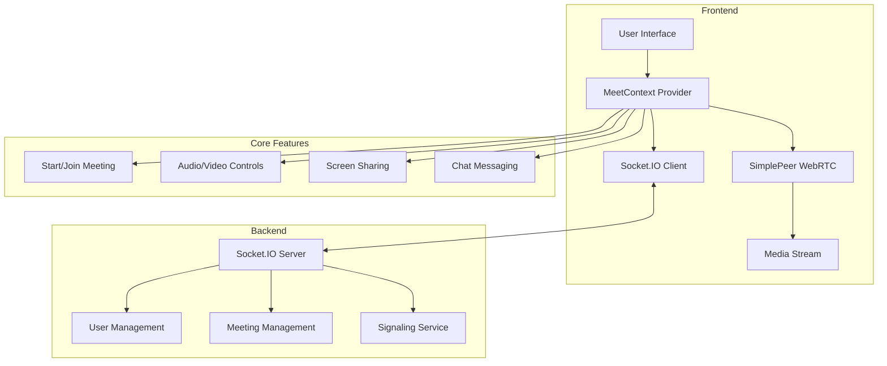

# Video Call Module - Frontend Integration

This module provides video calling functionality for the F-Career platform, connecting to an external video call backend service.

## Architecture



## Configuration

The video call module is configured to connect to the external backend service at:
- **Backend Server URL**: `http://localhost:8000`
- **WebSocket Namespace**: `/video-call`
- **Full WebSocket URL**: `http://localhost:8000/video-call`

To change the backend URL in production, update the constants in `utils/constants.ts`:

```typescript
export const BACKEND_URL = 'https://your-production-server.com';
export const SOCKET_NAMESPACE = '/video-call';
export const SOCKET_URL = `${BACKEND_URL}${SOCKET_NAMESPACE}`;
```

## Features

- Real-time video and audio communication
- Screen sharing
- Meeting creation and joining
- Audio/video controls
- User presence management

## Usage

### Starting a New Meeting

```typescript
import useMeetContext from '@/app/(public)/video-call/contexts/MeetContext';

// Inside your component
const { startNewMeet } = useMeetContext();

// Start a new meeting
const handleStartMeeting = () => {
  const userName = "John Doe";
  const userEmail = "john@example.com";
  const meetingName = "Team Meeting";
  
  startNewMeet(userName, userEmail, meetingName);
};
```

### Joining an Existing Meeting

```typescript
import useMeetContext from '@/app/(public)/video-call/contexts/MeetContext';

// Inside your component
const { joinMeet } = useMeetContext();

// Join an existing meeting
const handleJoinMeeting = () => {
  const userName = "Jane Doe";
  const userEmail = "jane@example.com";
  const meetingId = "meeting-id-to-join";
  
  joinMeet(userName, userEmail, meetingId);
};
```

### Media Controls

```typescript
import useMeetContext from '@/app/(public)/video-call/contexts/MeetContext';

// Inside your component
const { updateStreamAudio, updateStreamVideo, updateScreenSharing } = useMeetContext();

// Toggle microphone
const handleToggleMicrophone = () => {
  updateStreamAudio();
};

// Toggle camera
const handleToggleCamera = () => {
  updateStreamVideo();
};

// Toggle screen sharing
const handleToggleScreenSharing = () => {
  updateScreenSharing();
};
```

## Backend API Events

The module listens for the following events from the backend:

- `connect` - Socket connection established
- `connect_error` - Socket connection error
- `incoming-call` - Incoming call request
- `call-accepted` - Call accepted by recipient
- `call-rejected` - Call rejected by recipient
- `user-left` - User left the meeting
- `user-audio-update` - User audio status changed
- `user-video-update` - User video status changed
- `screen-sharing-update` - User screen sharing status changed
- `new-message` - New chat message received

## Dependencies

- socket.io-client
- simple-peer
- react-toastify

## Security Considerations

- All user data is transmitted through secure WebSocket connections
- User authentication should be implemented at the application level
- In production, ensure HTTPS is used for all connections 